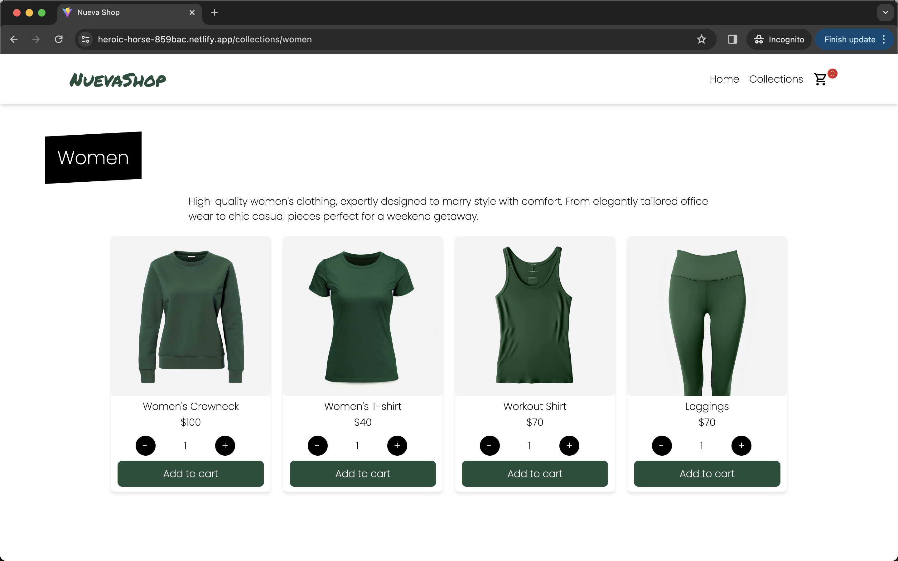

# Shopping Cart

A minimalist shopping cart implementation with ReactJS. Fetching products data from MockShop API and storing it locally in the browser. Using React components with states to implement neat and smooth user experience.

## Table of Contents

- [Demo](#demo)
- [Technologies](#technologies)
- [Contributing](#contributing)
- [License](#license)

## Demo

You can view the app at [Shopping Cart Demo](https://heroic-horse-859bac.netlify.app/).

## Technologies

- React
- Vitest
- TailwindCSS
- LocalStorage API
- MockShop API

## Contributing

Contributions are welcome! If you'd like to contribute to this project, please follow these guidelines:

1.  Fork the repository.
2.  Create a new branch for your feature or bug fix.
3.  Make your changes and commit them.
4.  Push your changes to your fork.
5.  Create a pull request.

## License

This project is licensed under the [MIT LICENSE](./LICENSE)
